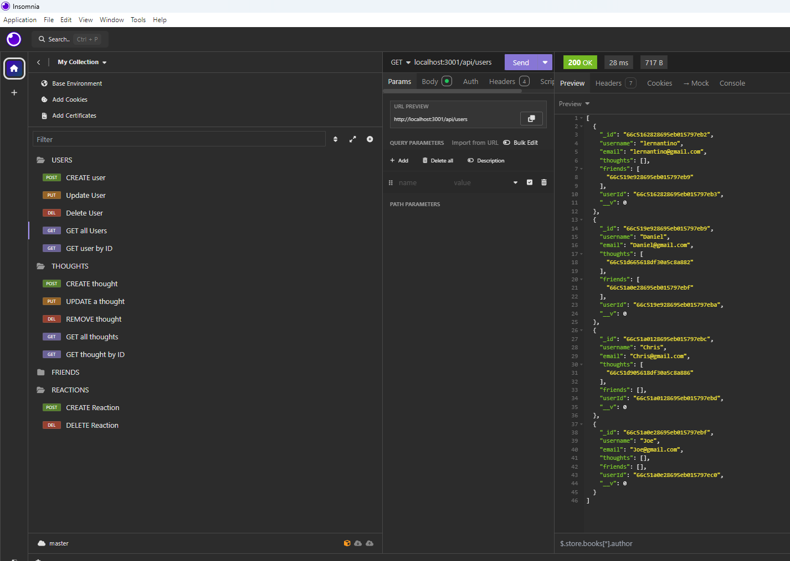

# Module 18 Social Network API
## Description
An API for a social network web application utilizing Express.js for routing, a MongoDB database, and the Mongoose ODM.
## Installation
Download the following repository https://github.com/WickedDan/SocialNetwork-Mod18.git
## Usuage Information
Run server.js to start server. Use Insomnia to make requests.
## Questions 
If you have questions check out my github WickedDan or you can email me at daniel@wickedflow.com;
## Screenshots

## Video Link
https://youtu.be/4VKDedHGwjg
## Deployment Link
(https://github.com/WickedDan/SocialNetwork-Mod18.git)

            